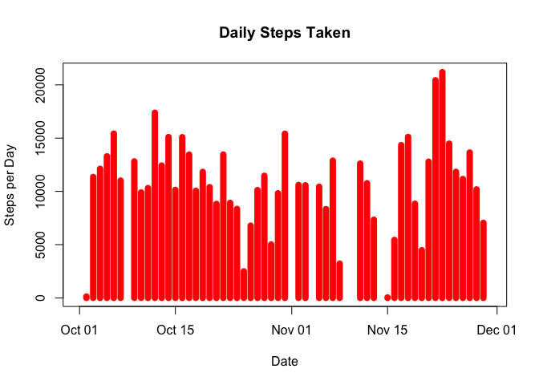
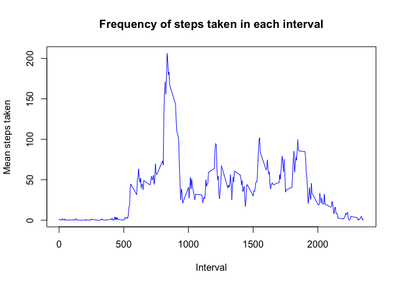
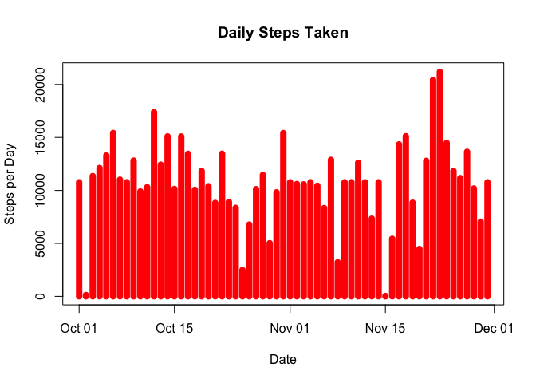

# Reproducible Research: Peer Assessment 1


## Loading and preprocessing the data

```r
activity_data <- read.csv('activity.csv')

# Convert the date column to 'date'
activity_data$date <- as.Date(activity_data$date) 
```

## What is mean total number of steps taken per day?
We can use the ddply and 'sum' on date.

```r
library(plyr)
activity_data_daily <- ddply(activity_data, "date", numcolwise(sum))
```

We can plot the daily steps to see steps taken

```r
plot(activity_data_daily$date, activity_data_daily$steps, type="h", 
     main="Daily Steps Taken", xlab="Date", ylab="Steps per Day", 
     col="red", lwd=8)
```

 

We can use the following functions to calculate the mean and median

```r
steps_mean <- mean(activity_data_daily$steps, na.rm=TRUE)
steps_median <- median(activity_data_daily$steps, na.rm=TRUE)
```
The mean for steps taken is 1.0766189\times 10^{4}. The median for steps taken is 10765

## What is the average daily activity pattern?
We will use the ddply again but instead sum on 'interval'


```r
activity_data_5min_mean <- ddply(activity_data, "interval", 
                                 numcolwise(mean, na.rm=TRUE))
```

To visualize the average steps taken in each interval, we can plot it.


```r
plot(activity_data_5min_mean$steps ~ activity_data_5min_mean$interval, type='l',
     main='Frequency of steps taken in each interval', xlab='Interval', 
     ylab='Mean steps taken', col='blue')
```

 


```r
max_value_index <- which.max(activity_data_5min_mean$steps)
```

The interval with average max steps is 835

## Imputing missing values
The number of NA's is 2304:sum(is.na(activity_data$steps))

Dealing with missing values:
In this assignment, I will use the mean for the 5 mins intervals calculated above
for NAs.


```r
activity_data_no_na <- activity_data
for(i in 1:nrow(activity_data_no_na)) {
    if(is.na(activity_data_no_na$steps[i])){
        activity_data_no_na$steps[i] <- 
        activity_data_5min_mean$steps[activity_data_5min_mean$interval == 
                                          activity_data_no_na$interval[i]]
        }
}
```

We can use the ddply and 'sum' on date.

```r
library(plyr)
activity_data_no_na_daily <- ddply(activity_data_no_na, "date", numcolwise(sum))
```
We can plot the daily steps to see steps taken with new dataset

```r
plot(activity_data_no_na_daily$date, activity_data_no_na_daily$steps, type="h", 
     main="Daily Steps Taken", xlab="Date", ylab="Steps per Day", 
     col="red", lwd=8)
```

 

We can use the following functions to calculate the mean and median

```r
steps_mean_no_na <- mean(activity_data_no_na_daily$steps)
steps_median_no_na <- median(activity_data_no_na_daily$steps)
```
The mean for steps taken is 1.0766189\times 10^{4}. The median for steps taken is 1.0766189\times 10^{4}


## Are there differences in activity patterns between weekdays and weekends?
